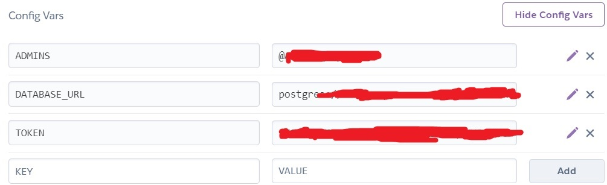

# Description
This is telegram messanger [inline bot](https://core.telegram.org/bots/inline)
for searching [voicelines of Team Fortress 2 characters](https://wiki.teamfortress.com/wiki/Responses)

Just open Telegram and type "\<bot alias\> \<request\>" in any chat

e.g. "@tf222bot morons"

You also can specify class:
"@tf222bot med: laughter" will search only Medic's laughter

[N-grams based search](https://en.wikipedia.org/wiki/N-gram) make this bot robust againt typos and allows to search with only parts of words

Currently (hopefully) hosted on heroku: @tf222bot


# Search algorithm

Each query splitted into tf2class ('' if not specified) and line

tf2class searched by full inclusion and works as a filer

Lines search is implemented with modified [N-grams based search](https://en.wikipedia.org/wiki/N-gram) 

Elements with the same score are will be in random order

# File Structure

`main.py`

Responsable for working with telegram

`query_handler.py`

Responsable for query search and creating index

`scrapper.py`

Responsable for scrapping audio files

`data_handler.py`

Chooses appropriate file storage handler

`data_handlers/file_system_data_handler.py`

Stores files locally on disk

`data_handlers/postgres_data_handler.py`

Stores files into postgresql

# Deployment

It is possible to deploy this bot on a ***`free`*** Heroku instance

for it you will need to

1. add postgresql
2. add ffpeg (to convert wav to mp3)

Assuming you already [connected to some heroku app](https://devcenter.heroku.com/articles/heroku-connect-api) you only need to run these commands:
```bash
heroku addons:create heroku-postgresql:hobby-dev
heroku buildpacks:add --index 1 https://github.com/jonathanong/heroku-buildpack-ffmpeg-latest.git
git push heroku master
heroku scale worker=1
```

Then you will need to set up environment variables

TOKEN  = \<telegram token>

ADMINS = \<list of admins' usernames seperated by ";">



(!!) After that you will need to call `/admin_scrap_and_cache_data` to cache all data inside telegram. **It might take several hours**

# Admin panel

You can run `/help` to bot and you will get

Most of the command accesable only by admin user

`/admin_scrap_and_cache_data`

This is important operation to get bot working

This command will scrap a site and send all found audios, converte them to mp3 and send to this chat to cache them

This is very heavy operation and will take several hours

`/admin_get_scrapper_config`

`/admin_upload_scrapper_config`

Config settings for scrapping {artist: [urls]}

`/admin_get_audio_ids`

`/admin_upload_audio_ids`

This operations needed if you want to move bot to another hosting and don't want to cache all data again

Just get audio ids from old location to another

`/admin_status`

Whether the bot is working