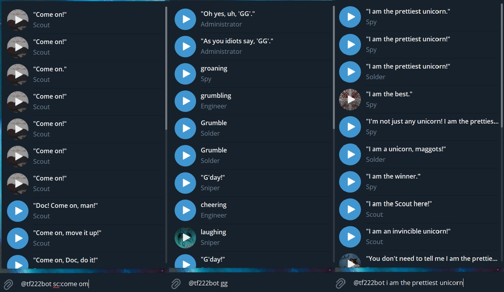

# Description
This is telegram messenger [inline bot](https://core.telegram.org/bots/inline)
for searching [voicelines of Team Fortress 2 characters](https://wiki.teamfortress.com/wiki/Responses) written in python
based on [n-grams]((https://en.wikipedia.org/wiki/N-gram)) and [vp-tree](https://en.wikipedia.org/wiki/Vantage-point_tree)

Can be called from any telegram by typing "\<bot alias\> \<request\>" in any chat

e.g. "\<bot alias\> morons"

You also can specify class:
"\<bot alias\> med: laughter" will search only Medic's laughter

Currently (hopefully) hosted on heroku: [`@tf222bot`](http://t.me/tf222bot)


# Search algorithm

Each query spitted into **tf2 class** (optional) and a **line**  

**tf2 class** acts as a filter: We either searching among some class or whole dataset

**line** search is implemented with slightly modified [N-grams based search](https://en.wikipedia.org/wiki/N-gram) which make this bot robust against typos and allows to search with only parts of words   

[VPtree](https://en.wikipedia.org/wiki/Vantage-point_tree) makes search in two a lot faster ways:  
1. Making complexity `O(log(N))` instead of O(N) for linear search or O(Nlog(N)) for naive implementation. Where N is the size of our collection ()
2. Since VPtree works in metrics space, it's allows skip heavy n-gram embedding step and save a lot of time

Elements with the same score will be in random order 

Other important thing: my distance function is **not** 100% metric function (not guarantee to satisfy triangle inequality), but it's good enough to make my search work

# File Structure

`main.py`

Responsible for working with telegram

`query_handler.py`

Responsible for query search and creating index

`scrapper.py`

Responsible for scrapping audio files

`data_handler.py`

Chooses appropriate file storage handler

`data_handlers/file_system_data_handler.py`

Stores files locally on disk

`data_handlers/postgres_data_handler.py`

Stores files into postgresql

# Deployment

It is possible to deploy this bot on a Heroku instance

for it you will need to

1. add postgresql
2. add ffpeg (to convert wav to mp3) (it's free)

Assuming you already [connected to some heroku app](https://devcenter.heroku.com/articles/heroku-connect-api) you only need to run these commands:
```bash
heroku addons:create heroku-postgresql:hobby-dev
heroku buildpacks:add --index 1 https://github.com/jonathanong/heroku-buildpack-ffmpeg-latest.git
git push heroku master
heroku scale worker=1
```

Then you will need to set up environment variables

TOKEN  = \<telegram token>

ADMINS = \<list of admins' usernames separated by ";">


(!!) After that you will need to call `/admin_scrap_and_cache_data` to cache all data inside telegram. **It might take several hours**

# Admin panel

You can run `/help` to bot and you will get

Most of the command accessible only by admin user

`/admin_scrap_and_cache_data`

This is important operation to get bot working

This command will scrap a site and send all found audios, convert them to mp3 and send to this chat to cache them

This is very heavy operation and will take several hours

`/admin_get_scrapper_config`

`/admin_upload_scrapper_config`

Config settings for scrapping {artist: [urls]}

`/admin_get_audio_ids`

`/admin_upload_audio_ids`

This operations needed if you want to move bot to another hosting and don't want to cache all data again

Just get audio ids from old location to another

`/admin_status`

Whether the bot is working